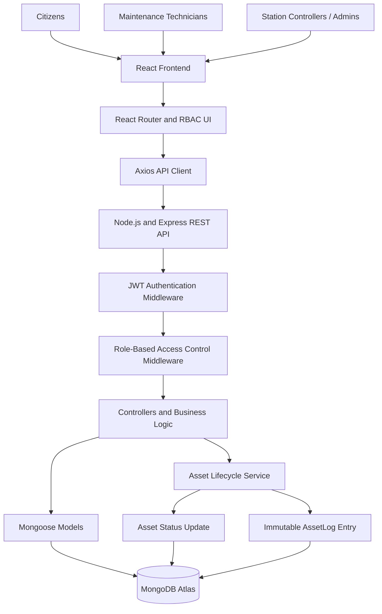
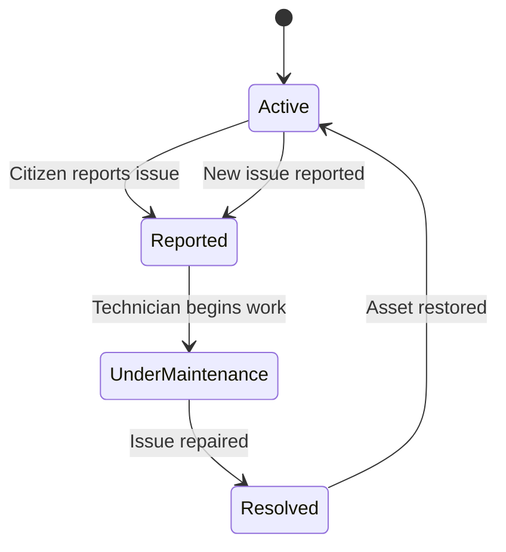

# 🚇 Centralized Infrastructure Asset Lifecycle Tracker — GMRC

A production-oriented, full-stack enterprise application designed for the **Gujarat Metro Rail Corporation (GMRC)** to monitor, manage, and audit infrastructure assets across metro stations.

The system provides centralized asset lifecycle management, role-based access control, real-time operational visibility, and an immutable audit trail for infrastructure maintenance activities.

---

## 📌 Table of Contents

* [Overview](#-overview)
* [Key Features](#-key-features)
* [System Architecture](#-system-architecture)
* [Technology Stack](#️-technology-stack)
* [Project Structure](#-project-structure)
* [Prerequisites](#-prerequisites)
* [Getting Started](#-getting-started)
* [Environment Variables](#-environment-variables)
* [Running the Application](#️-running-the-application)
* [Demo Credentials](#-demo-credentials)
* [User Roles and Access Control](#-user-roles-and-access-control)
* [API Documentation](#-api-documentation)
* [Database Models](#-database-models)
* [Asset Lifecycle Workflow](#-asset-lifecycle-workflow)
* [Security](#-security)
* [Future Enhancements](#-future-enhancements)
* [Contributing](#-contributing)
* [License](#-license)

---

## 📖 Overview

The **Centralized Infrastructure Asset Lifecycle Tracker** is a full-stack web application built to digitize and streamline infrastructure asset monitoring and maintenance operations for GMRC.

Metro infrastructure includes critical assets such as:

* Automatic Fare Collection (AFC) gates
* Escalators and elevators
* Platform and station safety systems
* Electrical and mechanical equipment
* Other station infrastructure and operational assets

Traditional maintenance systems often rely on disconnected records and manual status updates, making it difficult to maintain accountability, track asset history, and coordinate maintenance activities.

This application addresses these challenges through a centralized platform that connects citizens, maintenance technicians, and station controllers.

### Project Objectives

1. Centralize infrastructure asset information across metro stations.
2. Enable citizens to report malfunctioning infrastructure.
3. Assign and track maintenance activities through role-specific workspaces.
4. Maintain a chronological, immutable audit trail of asset state transitions.
5. Provide station controllers with operational dashboards and maintenance visibility.
6. Improve accountability, traceability, and transparency in infrastructure maintenance.

---

## 🚀 Key Features

### 1. Immutable Audit Trail

Every significant asset lifecycle transition generates a corresponding audit log entry.

For example:

`Active → Reported → Under Maintenance → Resolved`

Each audit event captures relevant information, including:

* Asset reference
* Previous and new asset status
* Timestamp of the state transition
* Actor responsible for the action
* Role of the actor
* Associated maintenance or reporting details

The asset's current state is maintained separately from its historical event records.

This enables station controllers to review a Jira-style visual timeline and trace the complete maintenance history of an asset.

### 2. Role-Based Access Control (RBAC)

The application provides three distinct user workspaces, each with role-specific permissions and interfaces.

| Role                       | Workspace                       | Key Capabilities                                                                           |
| -------------------------- | ------------------------------- | ------------------------------------------------------------------------------------------ |
| Citizen / Public           | Public reporting portal         | View permitted public information and submit infrastructure failure reports                |
| Maintenance Technician     | Mobile-friendly field interface | Review assigned work orders, inspect reported assets, and update maintenance status        |
| Station Controller / Admin | Desktop operations dashboard    | Monitor assets, manage operational activities, review metrics, and inspect audit timelines |

Authorization is enforced through backend middleware and protected API routes, rather than relying exclusively on frontend navigation.

### 3. Operations Dashboard

The station controller dashboard provides centralized operational visibility through:

* Live operational metrics and asset status summaries
* Searchable asset data table
* Pagination for large asset datasets
* Asset status and maintenance tracking
* Detailed asset information
* Visual chronological audit timelines

### 4. Citizen Reporting Portal

A mobile-friendly public interface allows citizens to report damaged or malfunctioning station infrastructure.

The reporting workflow creates an asset-related maintenance report and records the corresponding lifecycle event for traceability.

### 5. Maintenance Work Order Interface

Maintenance technicians can access their field workspace to:

* Review assigned maintenance tickets
* Inspect asset details and reported problems
* Update maintenance progress
* Mark assets as resolved or active after maintenance

### 6. Modern Enterprise UI/UX

The application uses a GMRC-aligned visual identity with:

* Deep Navy Blue and Vibrant Orange color palette
* Responsive layouts for desktop and mobile devices
* Light and Dark modes
* Reusable React components
* Toast notifications for user feedback
* Lucide icons and consistent interface elements

### 7. Secure Authentication

The authentication system includes:

* JWT-based authentication
* Password hashing using `bcryptjs`
* Protected frontend routes
* Backend authentication and authorization middleware
* One-click demo login options for quick evaluation and presentations

---

## 🏗️ System Architecture

The application follows a client-server architecture with a React frontend, an Express REST API, and a MongoDB database.



### Architecture Components

| Layer              | Responsibility                                              |
| ------------------ | ----------------------------------------------------------- |
| Presentation Layer | React pages, responsive UI, role-specific workspaces        |
| Routing Layer      | React Router and protected frontend routes                  |
| API Communication  | Centralized Axios configuration and REST requests           |
| Application Layer  | Express routes, controllers, validation, and business logic |
| Security Layer     | JWT verification, password hashing, and RBAC middleware     |
| Data Access Layer  | Mongoose schemas, models, and database operations           |
| Database Layer     | MongoDB Atlas for asset, user, and audit data               |

### End-to-End Data Flow

1. A user authenticates through the React login interface.
2. The backend validates the credentials and returns a JWT upon successful authentication.
3. The frontend includes the authentication token in subsequent protected API requests.
4. Express middleware verifies the token and checks the user's role.
5. The appropriate controller executes the requested operation.
6. Mongoose interacts with MongoDB to retrieve or update the relevant records.
7. For lifecycle transitions, the asset state update and corresponding audit log entry are persisted together using an appropriate database transaction strategy.
8. The API returns the result to the frontend, which updates the interface and displays relevant feedback.

---

## 🛠️ Technology Stack

### Frontend

| Technology      | Purpose                                      |
| --------------- | -------------------------------------------- |
| React.js        | Component-based user interface               |
| React Router    | Client-side navigation and route protection  |
| Tailwind CSS    | Utility-first styling and responsive layouts |
| Axios           | HTTP communication with the backend API      |
| Lucide React    | Icons and interface elements                 |
| React Hot Toast | Toast notifications and user feedback        |

### Backend

| Technology           | Purpose                                       |
| -------------------- | --------------------------------------------- |
| Node.js              | JavaScript runtime                            |
| Express.js           | REST API and backend routing                  |
| Mongoose             | MongoDB object modeling and schema validation |
| JSON Web Token (JWT) | Authentication and token-based identity       |
| bcryptjs             | Password hashing and verification             |

### Database and Infrastructure

| Technology     | Purpose                                              |
| -------------- | ---------------------------------------------------- |
| MongoDB Atlas  | Cloud-hosted NoSQL database                          |
| Git and GitHub | Source control and repository management             |
| Nodemon        | Automatic backend server restarts during development |
| Vercel         | Potential frontend hosting and deployment platform   |

---

## 📂 Project Structure

```text
grmc-asset-tracker/
│
├── server/                         # Express backend
│   ├── models/
│   │   ├── User.js                 # User schema
│   │   ├── Asset.js                # Infrastructure asset schema
│   │   └── AssetLog.js             # Audit event schema
│   │
│   ├── controllers/                # Business logic and handlers
│   ├── routes/                     # REST API endpoints
│   ├── middleware/                 # JWT and RBAC middleware
│   ├── server.js                   # Express application entry point
│   ├── package.json                # Backend dependencies and scripts
│   └── .env                        # Backend environment variables
│
├── client/                         # React frontend
│   ├── public/                     # Static assets
│   ├── src/
│   │   ├── components/             # Reusable UI components
│   │   ├── pages/                  # Role-specific application pages
│   │   │   ├── LandingPage.jsx
│   │   │   ├── LoginPage.jsx
│   │   │   └── OperationsDashboard.jsx
│   │   │
│   │   ├── services/               # Axios API configuration
│   │   ├── App.jsx                 # Master router and RBAC entry point
│   │   └── main.jsx                # React DOM mounting
│   │
│   ├── index.html
│   ├── package.json
│   └── vite.config.js
│
├── .gitignore
└── README.md
```

---

## 📋 Prerequisites

Ensure the following software and accounts are available before setting up the project.

| Requirement   | Version / Details                                |
| ------------- | ------------------------------------------------ |
| Node.js       | v18 or later recommended                         |
| npm           | Installed with Node.js                           |
| MongoDB Atlas | Cloud database account or local MongoDB instance |
| Git           | For cloning and version control                  |
| GitHub        | Repository hosting (optional for local setup)    |

---

## ⚙️ Getting Started

Follow the steps below to run the application locally.

### 1. Clone the Repository

```bash
git clone https://github.com/your-username/grmc-asset-tracker.git
cd grmc-asset-tracker
```

Replace `your-username` with the actual GitHub username or organization that owns the repository.

### 2. Configure the Backend

Navigate to the server directory and install the dependencies.

```bash
cd server
npm install
```

Create a `.env` file inside the `server/` directory.

Add the following environment variables:

```env
PORT=5000

MONGO_URI=your_mongodb_connection_string_here

JWT_SECRET=your_super_secret_jwt_key_here
```

Replace the placeholder values with your actual MongoDB connection string and a secure JWT signing secret.

### 3. Configure the Frontend

Open a separate terminal in the project root and navigate to the client directory.

```bash
cd client
npm install
```

If the frontend uses an environment variable for the backend URL, configure it in a `client/.env` file.

For a Vite application:

```env
VITE_API_URL=http://localhost:5000
```

Ensure that the Axios configuration uses the corresponding environment variable.

For example:

```javascript
const API_URL = import.meta.env.VITE_API_URL;
```

Use the actual API configuration and variable names defined in your project.

---

## ▶️ Running the Application

The backend and frontend must run simultaneously during local development.

### Start the Backend

Open a terminal and execute:

```bash
cd server
npm run dev
```

The Express backend will run at:

`http://localhost:5000`

### Start the Frontend

Open another terminal and execute:

```bash
cd client
npm run dev
```

The Vite development server will run at:

`http://localhost:5173`

Open the frontend URL in your browser to access the application.

> **Note:** The commands above assume that the backend `package.json` defines a `dev` script using Nodemon and the frontend uses Vite. Update the commands if your package scripts differ.

---

## 🔑 Demo Credentials

The following demonstration credentials are provided for application evaluation and presentations.

| Role                       | Email             | Password   | Access Level                                               |
| -------------------------- | ----------------- | ---------- | ---------------------------------------------------------- |
| Station Controller / Admin | `admin@gmrc.in`   | `admin123` | System dashboard, asset management, and audit timelines    |
| Maintenance Technician     | `tech@gmrc.in`    | `tech123`  | Maintenance workspace, field reports, and asset resolution |
| Citizen / Public           | Self-registration | N/A        | Public reporting portal                                    |

The login page also provides one-click demo login buttons for quick access to the respective workspaces.

> **Security Notice:** These are demonstration credentials. Do not use them in production. Replace demo passwords, enforce secure authentication policies, and ensure that demo accounts cannot access sensitive production data.

---

## 👥 User Roles and Access Control

### Citizen / Public

* Access the public reporting interface.
* Submit reports for damaged or malfunctioning infrastructure.
* View permitted public-facing information.

### Maintenance Technician

* Access the technician workspace.
* View assigned maintenance tickets.
* Review asset details and reported issues.
* Update maintenance status and mark resolved assets as active.

### Station Controller / Admin

* Access the operations dashboard.
* Monitor infrastructure assets and maintenance activity.
* Search, filter, and paginate asset records.
* Inspect asset details and lifecycle history.
* Review audit timelines and operational metrics.

Backend authorization middleware must validate user roles for protected operations, independently of frontend route restrictions.

---

## 🔌 API Documentation

The application exposes REST API endpoints for authentication, asset management, maintenance operations, and audit history.

### Authentication

| Method | Endpoint          | Description                          | Access |
| ------ | ----------------- | ------------------------------------ | ------ |
| POST   | `/api/auth/login` | Authenticate a user and return a JWT | Public |

### Asset Management

| Method | Endpoint                   | Description                                     | Access                     |
| ------ | -------------------------- | ----------------------------------------------- | -------------------------- |
| GET    | `/api/assets`              | Fetch a paginated list of metro assets          | Authenticated              |
| POST   | `/api/assets/:id/report`   | Report a broken asset and create an audit event | Citizen / Authorized users |
| POST   | `/api/assets/:id/fix`      | Mark an asset as resolved or active             | Technician / Admin         |
| GET    | `/api/assets/:id/timeline` | Retrieve the asset's audit history              | Admin / Technician         |

### Example: User Login

**Request**

```http
POST /api/auth/login
Content-Type: application/json
```

```json
{
  "email": "admin@gmrc.in",
  "password": "admin123"
}
```

**Expected response structure**

```json
{
  "message": "Login successful",
  "token": "<jwt_token>",
  "user": {
    "email": "admin@gmrc.in",
    "role": "admin"
  }
}
```

The response is illustrative. Actual response fields and status codes depend on the backend implementation.

### Example: Report a Broken Asset

```http
POST /api/assets/:id/report
Authorization: Bearer <jwt_token>
Content-Type: application/json
```

Example request body:

```json
{
  "description": "Escalator is not functioning properly",
  "location": "Example Metro Station"
}
```

The backend should validate the request, authorize the user, update the asset lifecycle state as appropriate, and persist the associated audit event.

### Example: Fetch Asset Timeline

```http
GET /api/assets/:id/timeline
Authorization: Bearer <jwt_token>
```

Returns the chronological lifecycle events associated with the requested asset, subject to authorization.

> **API Note:** The endpoints and request examples document the intended API interface. Verify the actual routes, request fields, response schemas, and status codes against the implemented Express controllers and route definitions.

---

## 🗄️ Database Models

The application uses MongoDB with Mongoose for schema modeling and database access.

### 1. User

Stores user identity, authentication information, and role assignments.

Typical fields:

* Name
* Email
* Password hash
* Role
* Account timestamps

Passwords should be stored as bcrypt hashes rather than plaintext values.

### 2. Asset

Represents a physical infrastructure asset installed at a metro station.

Typical fields:

* Asset name and unique identifier
* Asset category or type
* Station or location reference
* Current lifecycle status
* Relevant operational metadata
* Created and updated timestamps

### 3. AssetLog

Stores historical events associated with asset lifecycle transitions.

Typical fields:

* Asset reference
* Previous status
* New status
* Action performed
* Actor or user reference
* Actor role
* Event timestamp
* Relevant maintenance or reporting details

### Data Integrity

To support reliable lifecycle tracking:

* Validate asset status transitions on the backend.
* Associate audit events with authenticated actors.
* Prevent unauthorized modification or deletion of historical events.
* Use MongoDB transactions where supported to persist an asset transition and its corresponding audit event atomically.
* Apply appropriate indexes to frequently queried fields, such as asset identifiers, station references, status, and event timestamps.

An append-only application design supports auditability. Strong immutability guarantees additionally require suitable database permissions, restricted administrative access, and controls against direct database modification.

---

## 🔄 Asset Lifecycle Workflow

The following diagram illustrates a representative infrastructure maintenance workflow.



Each authorized transition should generate an audit event that records the actor, timestamp, and relevant status changes.

This allows station controllers to trace the history of an asset from its initial operational state through subsequent reporting and maintenance activities.

---

## 🔐 Security

Security is a core consideration for an enterprise infrastructure management application.

The implementation incorporates or is designed to support the following controls:

* **Authentication:** JWT-based authentication for protected API operations.
* **Password Protection:** Password hashing using `bcryptjs`.
* **Authorization:** Role-based backend middleware for restricted operations.
* **Input Validation:** Validate request payloads and identifiers before database operations.
* **Audit Integrity:** Restrict modification and deletion of historical audit records.
* **Secret Management:** Store database credentials and JWT signing secrets in environment variables.
* **Database Security:** Configure MongoDB Atlas network access and database users with appropriate permissions.

### Production Security Checklist

Before deploying a production instance:

* [ ] Replace demo credentials with secure account credentials.
* [ ] Generate a strong, unique JWT signing secret.
* [ ] Configure HTTPS for all externally accessible endpoints.
* [ ] Restrict CORS to approved frontend origins.
* [ ] Validate and sanitize incoming API requests.
* [ ] Configure rate limiting for authentication and public reporting endpoints.
* [ ] Enforce authorization checks on all protected backend routes.
* [ ] Restrict database access using least-privilege credentials.
* [ ] Configure secure token handling, expiration, and revocation or rotation policies.
* [ ] Review audit log retention, backup, and recovery procedures.

---

## 🚧 Future Enhancements

Potential future improvements include:

* Real-time maintenance alerts using WebSockets or server-sent events.
* QR-code-based asset identification at metro stations.
* Preventive maintenance scheduling and automated reminders.
* SLA tracking and maintenance performance analytics.
* Advanced filtering and reporting across stations and asset categories.
* Integration with existing enterprise maintenance or ticketing systems.
* Automated backups, monitoring, and production observability.
* Automated testing and CI/CD deployment pipelines.

These enhancements represent potential development directions and are not necessarily part of the current implementation.

---

## 🤝 Contributing

Contributions, suggestions, and bug reports are welcome.

To contribute:

1. Fork the repository.

2. Create a feature branch.

   ```bash
   git checkout -b feature/your-feature-name
   ```

3. Commit your changes.

   ```bash
   git commit -m "Add: your feature description"
   ```

4. Push the branch.

   ```bash
   git push origin feature/your-feature-name
   ```

5. Open a pull request describing the changes.

Ensure that contributions follow the project's coding conventions and do not include secrets, production credentials, or sensitive infrastructure information.

---

## 📄 License

Specify the applicable license before distributing this project.

If no license has been added to the repository, all rights remain with the copyright holder by default. Add an appropriate `LICENSE` file before permitting external reuse.

---

**Built with React, Node.js, Express, and MongoDB for centralized infrastructure asset lifecycle management.**

*Centralized monitoring. Accountable maintenance. Traceable infrastructure operations.*
